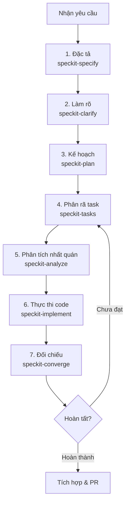

# Quy Trình Phát Triển Tính Năng với Agent & Spec-kit

Tài liệu này hướng dẫn cách phối hợp giữa lập trình viên (Developer), agent AI
và bộ công cụ **Spec-kit** để phát triển tính năng cho **Longevia Backend** một
cách nhất quán, an toàn và đúng cấu trúc.

---

## I. Tổng Quan Quy Trình

Quy trình Spec-kit chia việc phát triển một tính năng thành các giai đoạn độc
lập, tuần tự: đặc tả → làm rõ → lập kế hoạch → phân rã task → thực thi → đối
chiếu.

Chạy trọn một feature đầu-cuối có thể dùng `@speckit-orchestrate`; skill này tự
điều khiển analyze → implement → converge và tự quản git, gate, verification
theo policy riêng của nó.

---

## II. Các Giai Đoạn & Lệnh Thực Thi

Bắt đầu một tính năng mới (ví dụ `meal-planning`) bằng cách tạo một nhánh git
tương ứng (ví dụ `feat/meal-planning`) rồi chạy tuần tự:

### 1. Giai đoạn 1 — Đặc tả (Specification)
- **Lệnh:** `@speckit-specify <mô tả tính năng>`
- **Kết quả:** `specs/[###-feature-name]/spec.md` gồm User Stories, Requirements
  và Success Criteria đo lường được.

### 2. Giai đoạn 2 — Làm rõ (Clarify)
- **Lệnh:** `@speckit-clarify`
- **Kết quả:** các điểm mơ hồ trong `spec.md` được hỏi và cập nhật lại.

### 3. Giai đoạn 3 — Lập kế hoạch (Plan)
- **Lệnh:** `@speckit-plan`
- **Kết quả:** `plan.md` với Constitution Check, data model, contract (HTTP/gRPC/
  event) và thay đổi schema.

### 4. Giai đoạn 4 — Phân rã task (Tasks)
- **Lệnh:** `@speckit-tasks`
- **Kết quả:** `tasks.md`, task nhóm theo User Story, ghi rõ file cần sửa/tạo.

### 5. Giai đoạn 5 — Phân tích nhất quán (Analyze)
- **Lệnh:** `@speckit-analyze`
- **Kết quả:** đối chiếu `spec.md`, `plan.md`, `tasks.md` và constitution; báo
  cáo trùng lặp, mơ hồ, thiếu coverage. Không còn CRITICAL/HIGH mới qua bước 6.

### 6. Giai đoạn 6 — Thực thi code (Implement)
- **Lệnh:** `@speckit-implement`
- **Kết quả:** code theo từng task; mỗi task xong tick `[x]` trong `tasks.md`.
  Gate mỗi phase theo `AGENTS.md` §2.

### 7. Giai đoạn 7 — Đối chiếu (Converge)
- **Lệnh:** `@speckit-converge`
- **Kết quả:** phát hiện phần đã đặc tả nhưng chưa build; bổ sung task còn thiếu.

---

## III. Lệnh Bổ Trợ

### 1. Checklist chất lượng yêu cầu
- **Lệnh:** `@speckit-checklist <domain>` (ví dụ `security`, `api`)
- **Kết quả:** checklist trong `specs/[###-feature-name]/checklists/`.

### 2. Quản trị Constitution
- **Lệnh:** `@speckit-constitution`
- **Kết quả:** khởi tạo/cập nhật `.specify/memory/constitution.md` và đồng bộ
  template liên quan.

---

## IV. Nguyên Tắc Cốt Lõi

1. **Constitution là tối cao**: `.specify/memory/constitution.md` quy định luật
   thiết kế của dự án. Mọi thiết kế ở bước plan phải tuân thủ; nếu mâu thuẫn,
   cập nhật constitution trước khi code.
2. **Làm theo từng task nhỏ**: không yêu cầu agent viết toàn bộ tính năng cùng
   lúc; đi theo `speckit-implement` để kiểm soát chất lượng từng module.
3. **Kiểm thử sau mỗi bước**: sau mỗi task/user story quan trọng chạy `make lint`
   và test scoped; trước push/tag chạy `make check`.
4. **Lưu trữ trong `specs/`**: mọi tài liệu đặc tả, kế hoạch, task của tính năng
   nằm trong `specs/[###-tên-tính-năng]/` và phải commit cùng code.
5. **Gợi ý bước tiếp theo**: sau mỗi giai đoạn, agent phải chủ động đề xuất
   lệnh/skill kế tiếp cho dev.
6. **Phạm vi Spec-kit**: dành cho task lớn/feature phức tạp; task nhỏ, hotfix,
   sửa doc/config có thể làm trực tiếp nhưng vẫn theo §IV.
7. **Ngôn ngữ tài liệu trong `specs/`**: mọi tài liệu trong `specs/` (đặc tả, kế
   hoạch, checklist, tasks, báo cáo) **phải viết bằng tiếng Việt** để dev đọc và
   đối chiếu.
